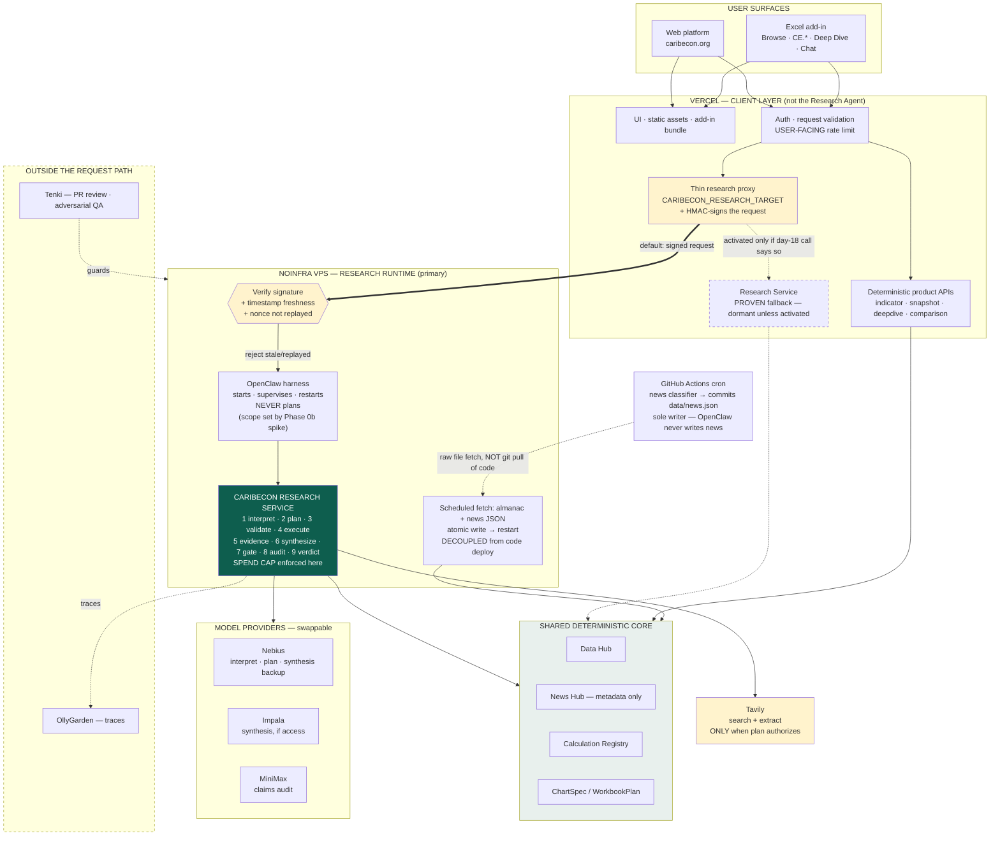
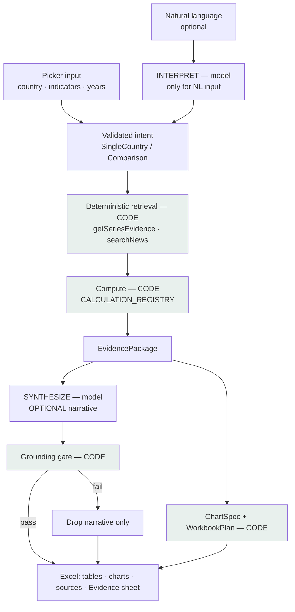
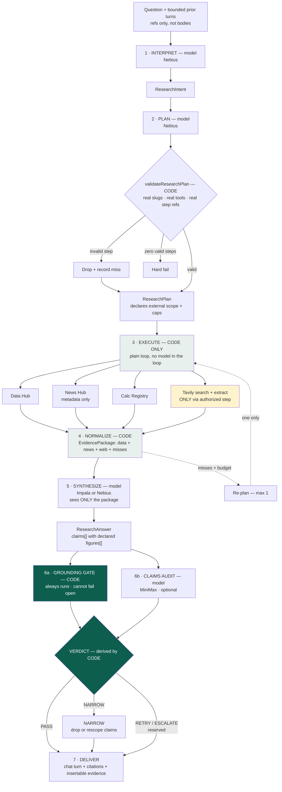
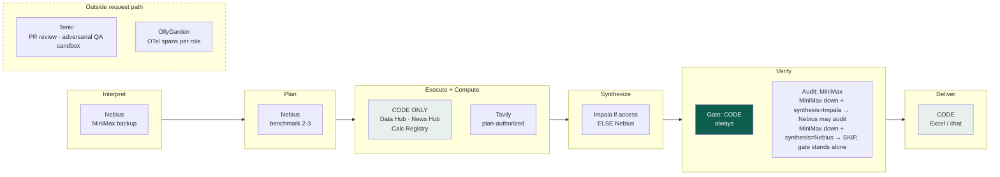

# CaribEcon — Refined Architecture & Execution Plan

> Reference document. Written against `CaribEcon_AskCaribEcon_Refined_Build_Prompt.md` (the prior
> plan) and the verified state of the repo on `feature/excel-addin`. **This document is now the
> canonical engineering plan for the whole product** — Browse, custom functions, Deep Dive,
> Comparison, and the Ask CaribEcon Research Agent alike. The prior build prompt is retired to a
> historical record; §6 (Migration) below records exactly what it kept, changed, and removed.

---

## 1. Executive assessment

### What is right in your direction

**The inversion is correct, and the code proves it — this is not a matter of taste.**

- [api/deepdive.ts](../api/deepdive.ts) makes **zero model calls**. Its numbers come from
  `getSeriesEvidence` → `CALCULATION_REGISTRY` → `buildWorkbookPlan`, all pure, all covered by
  existing tests. The current plan assigns a Verification role to a pipeline that has nothing to
  verify.
- [api/research.ts](../api/research.ts) — the *only* place prose is generated — records citations from
  what its tools served (`cite()`, [api/research.ts:299](../api/research.ts#L299)) and then **never
  checks the prose against them**. No grounding check, no refusal path, only a system prompt. The
  surface that can fabricate has the least governance in the system.

So the current plan puts heavy machinery where uncertainty is near zero and light machinery where it
is highest. Your thesis — *architecture should follow uncertainty* — is right.

Also right, and worth keeping explicitly:

- **Roles first, providers second.** Correct, and it's what makes the Impala question a config
  question rather than a rewrite.
- **Synthesis provider ≠ verification provider.** This is the single best instinct in your brief.
  It survives into the final design as a hard invariant, and it drives the synthesis-backup answer
  in §4.
- **Tavily authorized by the plan, not triggered by a News Hub miss.** Correct. A question can have
  News Hub hits and still need an IMF debt assessment. Zero-results is the wrong signal.
- **One service with multiple roles, not micro-agents.** Correct. Reinforced with reasons in §3.
- **Evidence normalization before synthesis.** Correct, and it is the load-bearing safety property.

### What is wrong, backward, or risky

**In your current plan file:**

1. **Verification and Planning are on the wrong workflow** (§6, §7, §9 Phases 2b/3b). Move both.
2. **Tavily's trigger is wrong** (§5, §6, §8, §9 Phase 5b) — "fires only after a News Hub miss"
   conflates "we found something" with "we found what's needed."
3. **`ASK_WEB_FALLBACK=off` by default in every environment** (§4). If external research is core to
   the product's value, shipping it off-by-default means shipping the product off.
4. **The Ask retriever "cannot access the web"** (§7). Now false by design — this line must go.
5. **§4 "fail closed" and §7 "degrade" contradict each other** and are never distinguished. They are
   two different code paths: missing *configuration* → 503 at request start; runtime *failure* of an
   optional role → degrade and record. Write both rules down separately.
6. **A ten-slot provider/model config matrix** (§4) for roles that don't exist yet.
7. **The Human Review Gate** (§6 step 7, §7, §9, §10) is redundant in a chat surface — the human is
   already there.

**In your new brief (things you're at risk of getting wrong):**

8. **"Ask CaribEcon should be the architectural center" — I'd reject this specific framing.** See
   the direct answer below; it changes what you'd build.
9. **Putting the whole research capability on a 21-day asset.** Settled: the Research Service runs on
   the NoInfra VPS with Vercel as the client layer (§5.1). That is a good split — but the demo lands
   near or past day 21, so it *must* ship with the Vercel fallback behind the same proxy (§5.4). The
   risk is not the choice of runtime; it is having only one.
10. **Assuming a "Research Executor" implies an agentic tool loop.** The most governed design is
    *plan once, execute in code*. See §2.

### Should the architecture be reoriented around the Research Agent?

**The research *pipeline* should get the most architecture. The research *agent* should not be the
architectural center.** The center is the **shared evidence core** — tool registry, calculation
registry, evidence contracts, grounding. Both pipelines are peers consuming it.

This distinction is not pedantic; it prevents a specific expensive mistake. If Ask is "the center,"
the natural next move is to route Deep Dive through the research pipeline for consistency — adding
model calls, latency, and failure modes to a workflow that works deterministically today. Keeping
the *core* central and the two pipelines as peers makes that mistake structurally unavailable.

> **Ask CaribEcon is the most demanding consumer of the core, not the core itself.**

---

## 2. Refined target architecture

### 2.1 Shared core (the actual center)

Everything below is deterministic code. No model may bypass it, and no model may produce anything it
produces.

| Component                      | Status                   | Files                                                                                                              |
| ------------------------------ | ------------------------ | ------------------------------------------------------------------------------------------------------------------ |
| Data Hub reader                | **exists**         | `src/lib/indicators.ts`                                                                                          |
| News Hub reader                | **exists**         | `src/lib/news.ts` — metadata only, enforced                                                                     |
| Resolution + intent validation | **exists**         | `canonicaliseIntent`, `resolveCountry`, `resolveIndicator` — [askTools.ts:145-194](../src/lib/askTools.ts#L145) |
| Series retrieval               | **exists**         | `getSeriesEvidence`, `getSelectedCountrySeries`                                                                |
| Calculation registry           | **exists**         | `CALCULATION_REGISTRY` + `inputYears` lineage — [calculations.ts:82](../src/lib/calculations.ts#L82)              |
| Comparability rules            | **exists**         | `addComparabilityCaveats` — [askTools.ts:394](../src/lib/askTools.ts#L394)                                          |
| Evidence package               | **exists**, extend | `EvidencePackage` — [askTools.ts:77](../src/lib/askTools.ts#L77)                                                    |
| Chart / workbook planning      | **exists**         | `buildChartSpecification`, `buildWorkbookPlan`                                                                 |
| Evidence identity              | **new**            | `EvidenceRef` namespace over `evidenceId()`                                                                    |
| External evidence              | **new**            | `src/lib/webEvidence.ts` (Tavily)                                                                                |
| Grounding gate                 | **new**            | `src/lib/ai/grounding.ts` — pure code                                                                           |
| Provider registry + adapter    | **new**            | `src/lib/ai/providers/`                                                                                          |

**The invariant that makes everything else work:** the synthesizer sees an `EvidencePackage` and
nothing else. Never raw search output, never a hub JSON blob, never a tool transcript.

### 2.2 Structured Analysis Pipeline (light, deterministic)

```
picker input ──────────────┐
                           ├──> validated intent ──> deterministic retrieval + compute
natural language ──> [interpret] ──┘                              │
                     (model, optional)                            v
                                                          EvidencePackage
                                                                  │
                                              ┌───────────────────┴─────────────┐
                                              v                                 v
                                     [synthesize] (model, optional)     ChartSpec / WorkbookPlan
                                              │                                 │
                                     grounding gate (code)                      │
                                              └───────────────┬─────────────────┘
                                                              v
                                          client-layer ReportBundle → Excel insertion
```

Key properties:

- **Explicit picker input takes zero model calls.** This is already true and must stay true.
- The natural-language front door is an **Interpreter only** — it produces the same validated
  `SingleCountryIntent` / `CountryComparisonIntent` the picker produces, then joins the identical
  deterministic path. It is roughly a 50-line addition, not a pipeline.
- **No planner. No model verifier.** The narrative is optional; if synthesis is unavailable or the
  gate rejects it, tables, charts, sources and caveats still write. That is already the documented
  fallback in the current plan §7 and it is correct.
- The grounding gate runs here too, because this workflow *does* generate prose. It is the same
  module — that is the payoff of a shared core.

### 2.3 Research Agent Pipeline (heavy, governed)

```
question (+ bounded prior turns)
  │
  ├─[1] INTERPRET        model   → ResearchIntent (reuses canonicaliseIntent)
  │
  ├─[2] PLAN             model   → ResearchPlan — real slugs, real tools, declared external scope
  │                                validateResearchPlan(): invalid steps DROPPED with a miss
  │
  ├─[3] EXECUTE          CODE    → plain loop over validated steps
  │                                Data Hub · News Hub · calc registry · Tavily (plan-authorized)
  │                                one optional re-plan if misses remain and budget allows
  │
  ├─[4] NORMALIZE        code    → EvidencePackage (data[] + news[] + web[] + misses + caveats)
  │
  ├─[5] SYNTHESIZE       model   → ResearchAnswer: claims[] each with declared figures[]
  │
  ├─[6a] GROUNDING GATE  CODE    → always runs · free · cannot fail open
  ├─[6b] CLAIMS AUDIT    model   → independent provider; degrades to 6a alone
  │      verdict = f(6a, 6b)  ← derived by CODE, never emitted by a model
  │
  └─[7] DELIVER          code    → chat turn + citations + insertable evidence
```

**The three decisions that carry this design:**

**(a) Plan once, execute in code — no model tool-loop.**
The Executor is a pure function of `(ResearchPlan, hub)`. This is what makes "more capable" and
"more governed" compatible rather than opposed:

- Tavily is reachable *only* through a validated plan step, so plan-authorization becomes a
  mechanically enforceable property instead of a promise.
- It eliminates the accumulating-history cost blow-up your own plan warns about at §7 line 281.
- The executor is testable with hand-built `ResearchPlan` fixtures and **no LLM mock** — which
  matters, because this repo has a standing policy of never mocking a provider
  ([api/research.test.mjs](../api/research.test.mjs) header).
- Adaptivity is preserved with **exactly one** re-plan, which sees only the misses, never the
  evidence.

**(b) Verification splits in two.**

|                | Grounding gate                                                                                                                                                    | Claims audit                                                       |
| -------------- | ----------------------------------------------------------------------------------------------------------------------------------------------------------------- | ------------------------------------------------------------------ |
| Implementation | pure code                                                                                                                                                         | model (independent provider)                                       |
| Runs           | always                                                                                                                                                            | when available + budget                                            |
| Cost           | zero                                                                                                                                                              | one call                                                           |
| Catches        | fabricated figures, invented URLs, wrong calc for unit, news-body claims, uncited numbers, quotes not in source, cross-currency comparison, out-of-coverage years | overreach, weak attribution, unhedged causal language, scope drift |
| Can fail open? | no                                                                                                                                                                | yes — degrades to gate alone                                      |

A verifier **cannot check truth** for qualitative research claims — only attribution and overreach.
Write that sentence into the module header. The failure mode of a safety gate is a reader assuming it
covered more than it did.

**The verdict is derived by code** from `(grounding, audit)`. A model emitting its own verdict is a
model grading a model with nothing checking the grader.

**(c) Verdict outcomes, honestly scoped for a chat surface.**

- `PASS` — publish.
- `NARROW` — drop or rescope offending claims ("among the 3 economies with 2025 data"). Never edits
  a number; only code can produce a number.
- `RETRY` / `ESCALATE` — **reserve the enum values, don't build the machinery yet.** In a chat
  surface both collapse to: publish what passed, state plainly what was withheld and why, let the
  user ask again. The human is already in the loop. This is what makes the current plan's Human
  Review Gate redundant.

### 2.4 Delivery surface — the Excel task pane chat

**Feasibility: yes, and it is the stronger version of the idea.** The task pane is a webview
(WebView2 on Windows, WKWebView on macOS), so a chat UI is a scrolling message list plus an input —
plain HTML/CSS/JS, consistent with the existing vanilla pane, no framework. The manifest already
declares a **shared runtime**, so conversation state persists across tab switches and for as long as
the pane is open.

**What beats a generic Claude/Copilot sidebar:** every answer carries a structured
`EvidencePackage`, so each turn can offer *Insert table · Insert chart · Insert report* that writes
real, provenanced cells. A generic chat sidebar can paste text. This one writes a sourced workbook —
and the renderers already exist (`writeTableSection`, `writeSourcesSection`, `addChart`,
`writeEvidenceSheet`).

#### Five constraints that shape the design

**C1 — The grounding gate is server-only.** `excel-addin/webpack.config.js` sets
`resolve.extensions` to `['.html','.js','.ts']` with **no `extensionAlias`**, so webpack cannot
resolve an explicit `./foo.js` specifier to a `foo.ts` on disk. The pane gets away with importing
`excelOutputs.ts` today *only* because every import in that file is `import type`. Any `src/lib/ai/*`
module with runtime imports is therefore **not importable by the pane**. The pane renders a verdict;
it never recomputes one.

**C2 — Build the workbook plan client-side, through one small, real adapter.** The service returns
exactly one thing, `ResearchResult` (§2.5) — answer, evidence, verdict — and **nothing
Excel-specific**. `buildWorkbookPlan` does not take a `ResearchResult`, though: its actual signature
is `buildWorkbookPlan(results: readonly IndicatorResult[], intent: SingleCountryIntent, misses)`
([excelOutputs.ts:522](../src/lib/excelOutputs.ts#L522)), and `IndicatorResult` is
`{ evidence: DataEvidence; periodAverage: CalculationResult; change: {...} }`
([excelOutputs.ts:281](../src/lib/excelOutputs.ts#L281)) — a shape a research answer doesn't arrive
in. The gap is real but small, because every piece `IndicatorResult` needs is already a pure,
existing function: `api/deepdive.ts` computes exactly this today from a bare `DataEvidence`. The
pane-side adapter is that same composition, reused rather than reinvented:

```ts
/* EvidencePackage.data is already DataEvidence[] — the only thing missing to make it an
   IndicatorResult[] is periodAverage and change, and both are pure functions that already exist.
   Zero new calculation logic; this is exactly what api/deepdive.ts:110-121 already does per
   series, lifted into a reusable adapter both call sites can share. */
function toIndicatorResults(data: readonly DataEvidence[]): IndicatorResult[] {
  return data.map(evidence => {
    const name = calculationForUnit(evidence.unit);
    const results = (name === 'pp_change' ? pp_change : yoy_change)(evidence.points);
    return { evidence, periodAverage: period_average(evidence.points), change: { name, results } };
  });
}
```

```
ResearchResult.evidence.data → toIndicatorResults() → IndicatorResult[]
                                                              ↓
        ResearchIntent (single country) → SingleCountryIntent ↓
                                                              ↓
                                              client-side buildWorkbookPlan()
                                                              ↓
                                                        WorkbookPlan → Excel insertion
```

**Known, explicit limit — not solved here, not silently assumed away:** `SingleCountryIntent.country`
is one string ([excelIntent.ts:30](../src/lib/excelIntent.ts#L30)). A single-country research answer maps
cleanly. A multi-country research answer (a comparison-shaped Ask question) does not fit
`buildWorkbookPlan`'s title/section assumptions today — **insertion for multi-country answers is a
documented future gap, not something Phase 1 needs to solve**, consistent with not building machinery
the current scope doesn't need. Single-country insertion works end to end now.

**The Research Service knows nothing about Excel.** Returning a `WorkbookPlan` from the server would
weld it to one client, and `toIndicatorResults` stays entirely on the client for the same reason —
it belongs beside `buildWorkbookPlan` in the pane, which already imports `excelOutputs.ts` at
[taskpane.js:34](../excel-addin/src/taskpane/taskpane.js#L34), not inside the service.

**C3 — Turn state is refs, not bodies — and web evidence is turn-local.** The client posts prior
turns carrying **evidence refs only**. `D:` and `N:` refs re-hydrate deterministically from the hub,
so they are safe to carry across turns. Capped at `MAX_HISTORY_TURNS 4` / `MAX_REHYDRATED_REFS 40`.

**`W:` web evidence is turn-local by default and is never accepted back from the client.** The
browser is an untrusted boundary: a client that echoed back "here is the text that IMF page said"
could alter that text while keeping the schema valid, and the grounding gate (§2.6) would then
cheerfully verify a fabricated quote against fabricated evidence — defeating the gate precisely where
it matters most. So:

- Only web evidence retrieved **in the current request** may enter the `EvidencePackage` used for
  publication.
- If a follow-up turn needs an external source again, it is **re-retrieved**, spending that turn's
  own Tavily budget.
- Server-side caching or cryptographically signed evidence state are the correct future
  optimizations. Client echo is not one of them.

The honest cost: *"tell me more about that IMF report"* triggers a fresh retrieval. Accepted.

**C4 — A generic working state, not fake stage progress.** A plain request returns **nothing** to the
client until the whole answer arrives — so the pane genuinely cannot know that the server is
currently "retrieving 3 series." Claiming otherwise would be theatre.

For the MVP: a generic **"Researching…"** state plus a client-side elapsed-time indicator. Token
streaming stays out of scope. The pane's `AbortController` must be set **shorter** than the server's
wall-clock budget so the client fails first and says something honest.

*Future enhancement:* if genuine live stage updates are wanted, add a lightweight **SSE stage-event
channel** — separate from, and much simpler than, model token streaming. Not MVP.

**C5 — Width and rebuild discipline.** Default pane is ~320px, user-resizable by dragging: the
design must be legible at 320 and scale up. `EDDESIGN.md` governs, same as the site. And
`npm run build:addin` copies to `public/addin/`, which is committed and served — **re-run it after
every pane change** or the deployed add-in silently serves the old bundle.

#### What ships when

| Phase        | Task pane                                                                                                      |
| ------------ | -------------------------------------------------------------------------------------------------------------- |
| **1**  | Message list, input, one turn at a time, generic "Researching…" state, error states, per-turn*Insert table* |
| **2**  | Gate verdict rendering — what was withheld and why, in plain language                                         |
| **3**  | Source transparency — which hub series and which external sources were consulted                              |
| **4+** | Multi-turn history UI,*Insert report*, then the caribecon.org web surface                                    |

**One line from the current plan §8 to keep and sharpen:** *"Do not expose reasoning traces,
internal tool calls, provider messages, or secrets."* That survives — but draw the distinction
explicitly, because Phase 3 sits right on it: **evidence provenance is shown** (which series, which
article, which URL, which vintage); **model deliberation is never shown** (prompts, plan reasoning,
verifier rationale, raw tool transcripts). The user is entitled to know what the answer rests on, not
how the model talked itself there.

### 2.5 Typed contracts

Runtime-agnostic and provider-agnostic, as you asked. **Several already exist — map before you
build, because rebuilding these is the most common way to end up with two sources of truth.**

| Contract                                                                                 | Status                   | Location                                           |
| ---------------------------------------------------------------------------------------- | ------------------------ | -------------------------------------------------- |
| `SingleCountryIntent` / `CountryComparisonIntent` — your `StructuredRequest`      | **exists**         | `src/lib/excelIntent.ts`                         |
| `ChartSpec`                                                                            | **exists**         | [excelOutputs.ts:96](../src/lib/excelOutputs.ts#L96)   |
| `WorkbookPlan`                                                                         | **exists**         | [excelOutputs.ts:266](../src/lib/excelOutputs.ts#L266) |
| `EvidencePackage`, `DataEvidence`, `DataPoint`, `RetrievalMiss`                  | **exists**, extend | [askTools.ts:44-84](../src/lib/askTools.ts#L44)        |
| `NewsEvidence`                                                                         | **exists**         | [news.ts:27](../src/lib/news.ts#L27)                   |
| `CalculationResult` (carries `inputYears` lineage)                                   | **exists**         | [calculations.ts:9](../src/lib/calculations.ts#L9)     |
| `AskIntent` → `ResearchIntent`                                                      | extend existing          | `askTools.ts` → `ai/contracts.ts`             |
| `EvidenceRef`, `EvidenceMeta`, `WebEvidence`                                       | new                      | `src/lib/ai/contracts.ts`                        |
| `ResearchPlan`, `ResearchStep`                                                       | new                      | "                                                  |
| `ResearchAnswer`, `Claim`, `StatedFigure`                                          | new                      | "                                                  |
| `GroundingResult`, `ClaimsAudit`, `VerificationVerdict`                            | new                      | "                                                  |
| **`ResearchResult`** — the canonical, client-agnostic Research Service response | new                      | "                                                  |

**`ResearchResult` is the one and only Research Service response shape.** Earlier drafts of this
document used `ResearchResult`, `ReportBundle`, and loose "endpoint response" language somewhat
interchangeably — that inconsistency is fixed here, and it matters because a service with two names
for its own output invites two implementations of it.

```ts
/* THE canonical Research Service response. The service returns exactly this and nothing more —
   in particular, nothing Excel-shaped. A client renders it however it needs to. */
export interface ResearchResult {
  answer: ResearchAnswer;
  evidence: EvidencePackage;
  verdict: VerificationVerdict;
}
```

If a `ReportBundle` is useful later, it is a **client-layer** structure — e.g. the Excel pane's own
`{ result: ResearchResult; workbookPlan: WorkbookPlan }` after it runs `buildWorkbookPlan` locally
(§2.4 C2). It is never what the Research Service returns.

```ts
/* One ID namespace over three evidence classes, built ON TOP of askTools.evidenceId() rather
   than replacing it — that string is written into users' saved workbooks. Evidence identity is
   conceptually askTools.ts's domain, but the implementation itself lives in excelOutputs.ts,
   which askTools.ts imports and re-exports unchanged: excelOutputs.ts must stay free of runtime
   imports so the Excel task pane can keep bundling it (webpack has no resolve.extensionAlias, so
   it can never resolve an explicit ./foo.js specifier to a sibling .ts file — see C1 below).
   Prefixed so the gate knows what it holds without a lookup.

   IMPORTANT — identity vs. version: this ref identifies the SOURCE/SERIES, not a frozen value.
   "D:GY:nominal_gdp" is stable so a workbook cell can always be traced back to its series — but
   the series itself can be revised (a vintage updates, a figure is restated). The ref is what
   the gate looks the number up by; EvidenceMeta (below) is what says which VERSION was actually
   used to answer a given question. Conflating the two would make reproducibility impossible: you
   could trace a claim back to "the Guyana GDP series" without ever knowing which vintage of it
   produced the number in front of you. */
export type EvidenceRef =
  | `D:${string}`   // D:GY:nominal_gdp — the series identity; stable across revisions
  | `N:${string}`   // N:<news id>      — deployment-stable (CI regenerates news.json daily)
  | `W:${string}`;  // W:<sha256(url)>  — THIS REQUEST ONLY. Never accepted back from a client — see §2.4 C3.

/* The version actually used, alongside the stable ref. Reuses DataEvidence.vintage — no new
   provenance concept, just made addressable per-ref rather than only per-series. Carried on
   EvidencePackage.evidenceMeta (below) — a type that exists but is never attached to anything is
   dead weight, not a contract. */
export interface EvidenceMeta {
  ref: EvidenceRef;
  vintage: string | null;           // DataEvidence.vintage — dataset vintage, when the hub has one
  retrievedAt: string;              // ISO instant this ref was resolved for THIS result
  sourceRevisionDate: string | null; // publisher's own revision date, when known (mostly W:)
  contentHash: string | null;        // optional; strongest reproducibility signal when present
}

export interface WebEvidence {
  id: string; title: string; url: string; domain: string;
  publishedDate: string | null;   // only when Tavily supplies one
  retrievedAt: string;            // ISO instant — this is the web; it moves under you
  snippet: string;
  /* Present only when Extract ran. THIS is what makes web a different class from news:
     quotable. Char-capped, always labeled external, never rendered as a CaribEcon source.
     A figure may be published against this ref ONLY when extract is non-null AND the gate
     reconciles the stated number against extract.text — see §2.6 check 11. A snippet alone is
     never sufficient grounding for a quantitative claim. */
  extract: { text: string; chars: number } | null;
  /* Which validated plan step authorized this fetch. Without it, "authorized by the plan" is a
     claim rather than a checkable property. */
  authorizedBy: string;           // ResearchStep['id']
}

export type ResearchStep =
  | { id: string; tool: 'get_series';     country: string; indicator: string; yearFrom: number|null; yearTo: number|null; why: string }
  | { id: string; tool: 'compare_series'; countries: string[]; indicator: string; yearFrom: number|null; yearTo: number|null; why: string }
  | { id: string; tool: 'search_news';    countries: string[]; keywords: string[]; dateFrom: string|null; dateTo: string|null; why: string }
  | { id: string; tool: 'search_web';     query: string; dateFrom: string|null; dateTo: string|null; why: string }
  | { id: string; tool: 'extract_web';    onStep: string; maxUrls: number; why: string };

export interface ResearchPlan {
  question: string;               // echoed verbatim; the auditor compares scope against it
  scope: { countries: string[]; indicators: string[]; yearFrom: number|null; yearTo: number|null };
  steps: ResearchStep[];          // truncated to MAX_PLAN_STEPS, not rejected
  /* Renamed from "unanswerable": the planner is guessing BEFORE retrieval runs, so it can name
     what looks out of reach, never certify what actually is. "Unanswerable" claimed a certainty
     the planner cannot have at this point in the pipeline. */
  anticipatedGaps: string[];
}

export interface Claim {
  /* Stable per answer, independent of array position — so downstream filtering, reordering, or
     partial publication can never silently point publishedClaims at the wrong claim. */
  id: string;
  text: string;
  refs: EvidenceRef[];            // [] allowed ONLY when type === 'framing'
  type: 'figure' | 'trend' | 'context' | 'framing';
  /* The highest-leverage field in the design: turns "parse figures out of prose" (lossy, never
     finishes) into "cross-check prose against declared figures" (exact). */
  figures: StatedFigure[];
}

export interface StatedFigure {
  ref: EvidenceRef;
  year: number | null;
  value: number;                        // unit-normalised
  unit: string;
  calculation: CalculationName | null;  // null = raw retrieved value
  asWritten: string;                    // "16.3%" — the literal substring in `text`
}

/* Three distinct "what's missing" concepts, deliberately not merged into one field:
     ResearchPlan.anticipatedGaps — guessed BEFORE retrieval, by the planner
     EvidencePackage.misses       — ACTUAL retrieval misses, by CODE (askTools.ts, unchanged)
     ResearchAnswer.gaps          — what the FINAL answer could not address, after synthesis
   Collapsing these would hide exactly the "planner guessed wrong" or "retrieval found less than
   expected" signal that makes the pipeline debuggable. */
export interface ResearchAnswer { headline: string; claims: Claim[]; gaps: string[]; }

export type ReasonCategory =
  | 'ungrounded_figure' | 'source_conflict' | 'low_confidence' | 'unattributed_causation';

export interface VerificationVerdict {
  outcome: 'PASS' | 'NARROW' | 'RETRY' | 'ESCALATE';   // DERIVED BY CODE, never model-emitted
  grounding: GroundingResult;    // always present
  audit: ClaimsAudit;            // { ran: false } until Phase 4, or when skipped per §4.1
  publishedClaims: string[];     // Claim.id[] — NARROW drops or rescopes — never edits a number
  /* Plural: one answer can trip more than one issue at once (e.g. an ungrounded figure AND
     unattributed causation in different claims). A single category would force the verdict to
     pick just one and silently drop the rest. */
  reasonCategories: ReasonCategory[];
}
```

**`EvidencePackage` gains exactly two additive fields: `web?: WebEvidence[]` and
`evidenceMeta: EvidenceMeta[]`.** The second is what actually attaches `EvidenceMeta` to something —
one entry per unique `EvidenceRef` pulled into the package, populated by `buildEvidencePackage` (or
its Research-Agent equivalent) at the moment each ref is resolved, so `retrievedAt`/`vintage` reflect
*this* request rather than being reconstructed after the fact.
[askTools.test.mjs:337](../src/lib/askTools.test.mjs#L337) checks key *presence*, not exhaustiveness, so
both additions are safe and the suite stays green. The uniform envelope is a **derived view**
(`toEvidenceItems(pkg)`), **not** a migration of `DataEvidence`/`NewsEvidence` — migrating would
touch three working modules and their tests to serve a consumer that does not exist yet.

### 2.6 The grounding gate — specification

Pure code. Always runs. Free. Cannot fail open.

**Checkable exactly, against the `EvidencePackage`:**

1. **Ref existence** — every `Claim.refs[]` and `StatedFigure.ref` resolves. Set membership.
2. **URL allowlist** — every URL in prose, normalised (lowercase host, strip trailing slash, strip
   `utm_*`), must `===` a `DataEvidence.sourceUrl`, `NewsEvidence.url`, or `WebEvidence.url`.
   *This is the check `api/research.ts` has never had.*
3. **Slug / country tokens** — any hub slug or full country name in prose must be in the retrieved
   set. Skip bare 2-letter codes; too noisy.
4. **Figure reconciliation** — `calculation === null` → look up the point. Otherwise **re-run the
   registry function** and compare at that year. `CalculationResult.inputYears` gives the violation
   message its lineage for free.
5. **Wrong change-calculation** — `unit === '%'` claimed as `yoy_change` is a violation on its own.
   The gate enforces the same rule [`calculationForUnit`](../src/lib/excelOutputs.ts#L36) already
   enforces deterministically.
6. **Unstated numbers** — every numeric literal in prose must be a declared figure, a year in range,
   or a small ordinal ("three indicators"). Catches a figure stated but not declared.
7. **News-body claims** — a claim refing only `N:` items may carry **no figures** and no quoted run
   over ~5 words. You only have headlines. This makes the metadata-only rule *code*, not a prompt.
8. **Quote check (web only)** — a quoted span on a `W:` ref must be a **substring of that item's
   `extract.text`**. Exact, cheap, and the only place quoting is legal.
9. **Cross-currency comparison** — figures spanning two refs with different non-`%` units plus a
   comparative token (`more than|larger|vs|exceeds|times|double`) → flag.
10. **Coverage honesty** — a year named outside that ref's retrieved range → `year_outside_coverage`.
11. **W: figure reconciliation — the explicit rule for external quantitative claims.** A `StatedFigure`
    whose `ref` is `W:*` is publishable **only if**:

    - that `WebEvidence.extract` is non-null (a search snippet alone is never sufficient), **and**
    - the numeric value in `asWritten` can be **deterministically located in `extract.text`** —
      the same written-string-to-actual-number matching `figureMatches` below applies, run against
      the extracted text rather than a hub series.

    A model may never introduce a number merely because a web page was retrieved. If check 8's
    quote rule is "the *words* must be in the source," this is its numeric counterpart: "the
    *number* must be in the source." Provenance for any `W:`-grounded figure is always traceable in
    one direction:

    ```
    StatedFigure → EvidenceRef → W:<id> → trusted WebEvidence.extract.text
    ```

    A figure resting on a `W:` ref with no extract, or whose value cannot be located in the extract
    text, fails grounding — full stop, same as an internal figure that fails check 4.

**Number matching must not be string comparison.** Read precision off the written form, compare
numerically, normalise magnitude against the *series* unit:

```ts
/* A model writes 16.3 for 16.326, "1.75 bn" for 1,750,288 in a "US$ mn" series, "about 62%" for
   62.3. Precision is read off the string — that is what makes both "16.3" and "16.33" checkable. */
function figureMatches(stated: number, actual: number, asWritten: string): boolean {
  const decimals = asWritten.match(/\.(\d+)/)?.[1].length ?? 0;
  if (Number(actual.toFixed(decimals)) === Number(stated.toFixed(decimals))) return true;
  return Math.abs(stated - actual) <= Math.abs(actual) * 1e-3;   // "about", "~", "roughly"
}
```

Name these in the module header so nobody rediscovers them at 2am: `(3.2)` and U+2212 negatives ·
thousands separators · year-vs-value ambiguity (`2015` is both) · en-dash ranges · `0.62` vs `62%`
vs `62.0 percent`.

**What the gate genuinely cannot check — put this list IN the module header:**

- Whether a **causal claim is true.** Code can detect causal *language*
  (`drove|caused|led to|because|resulted in`) and require hedging or `type: 'framing'`. It cannot
  adjudicate direction.
- Whether **evidence selection is representative** — cherry-picking a favourable window is invisible
  to a gate that only checks what was cited.
- Whether a **forecast or scenario is reasonable.** There is no evidence for a counterfactual. Force
  such claims into `type: 'framing'` with `figures: []`, so they are visibly not asserted as sourced
  fact.
- Whether a **web source is credible.** Code checks the domain matches what Tavily returned. Nothing
  more.
- Whether the answer **answers the question.**

Those five lines are worth more than any single check, because a safety gate's worst failure mode is
a reader assuming it covered more than it did.

### 2.7 Memory — context, not truth

The whole policy compresses to one line:

> **Memory may change the question. It may never change the answer.**

Memory is allowed to inform `interpret()` and `plan()` — remembering that the last three turns were
about Guyana, or that this user keeps returning to debt sustainability. That shapes *what the system
goes looking for*. It is never allowed to satisfy an evidence requirement.

**Rules:**

1. **A factual claim recalled from memory is a lead, not a source.** It must be re-retrieved through
   the Data Hub, News Hub, Calculation Registry, or authorized external research before it can appear
   in an answer. The grounding gate (§2.6) enforces this automatically and needs no special case:
   a figure with no `EvidenceRef` in the current package fails, regardless of where it came from.
2. **Bounded conversational memory for the buildathon.** Compact turns plus `EvidenceRef`s — never
   evidence bodies. Capped at `MAX_HISTORY_TURNS 4` / `MAX_REHYDRATED_REFS 40`. `D:` and `N:` refs
   re-hydrate deterministically from the hub across turns. **`W:` refs do not** — web evidence is
   turn-local by construction (§2.4 C3) because the browser is an untrusted boundary: a client
   echoing back "here is what that page said" could alter the text while keeping the schema valid,
   which would let the grounding gate verify a fabricated quote against fabricated evidence. If a
   later turn needs that external source again, it is re-retrieved. Only evidence retrieved in the
   **current** request may enter the `EvidencePackage` used for publication — trusted current-request
   evidence, not client-supplied history, is what synthesis and the gate are allowed to see.
3. **No contract may depend on OpenClaw memory types.** `ResearchIntent`, `ResearchPlan`,
   `EvidencePackage`, `ResearchAnswer`, and `ResearchResult` stay runtime-agnostic (§5.3 rule 1).
   If persistent memory ever disappears, every contract still type-checks and every request still
   works — it just starts colder.
4. **Persistent memory is a later, separate capability.** OpenClaw memory or Brain may eventually
   hold user preferences, saved research context, recurring interests, or workflow state. None of
   those are evidence, and none are in scope now.

The reason this boundary is worth defending: persistent memory is the most natural-feeling way to
destroy a grounding guarantee. A system that "remembers" Guyana's 2024 GDP figure and states it
without re-retrieval has fabricated it — the number may even be right, but nothing in the answer can
prove it, and the next refresh of the hub can silently make it wrong.

---

## 3. Agent / role and tool inventory

### 3.1 Logical roles — six, in one service

**One deployed Research Service exposing six role functions.** Not six deployables.

```ts
interpret(question, history)        → ResearchIntent
plan(intent)                        → ResearchPlan
executeResearch(plan)               → RawEvidence[]      // CODE, no model
buildEvidencePackage(raw, intent)   → EvidencePackage    // CODE, no model
synthesize(intent, pkg)             → ResearchAnswer
verify(answer, pkg)                 → VerificationVerdict // gate (code) + audit (model)

/* The service's one public entry point — composes the six roles above and returns the
   canonical, client-agnostic contract (§2.5). This is `research(req) -> ResearchResult` from
   §5.3 rule 1: the function every runtime adapter (NoInfra, Vercel) wraps identically. */
research(request)                   → ResearchResult
```

**Why one service and not micro-agents** — four reasons, in order of weight:

1. **Every hop is latency you cannot recover.** Five HTTP hops inside a 45-second budget is pure
   overhead against a pipeline that already has 3-4 unavoidable model round-trips.
2. **The roles share one object.** They pass `EvidencePackage` between them. In one process that's a
   reference; across services it's serialization, schema versioning, and partial-failure handling —
   for zero benefit.
3. **Portability collapses to one unit.** One service moves to any runtime with a thin HTTP wrapper.
   N services need orchestration infrastructure you'd then depend on.
4. **Independent scaling is a non-problem here.** These roles run once each, sequentially, per
   request. There is nothing to scale independently.

Micro-agents would be justified if roles ran at different rates, had different resource profiles, or
were owned by different teams. None applies.

| Role             | Required now            | Notes                                            |
| ---------------- | ----------------------- | ------------------------------------------------ |
| Interpret        | **yes**           | Thin — mostly reuses`canonicaliseIntent`      |
| Plan             | Phase 3                 | Ship a hardcoded default plan first              |
| Execute          | **yes**           | Code. Starts as existing`buildEvidencePackage` |
| Evidence builder | **yes**           | Extends what exists                              |
| Synthesize       | **yes**           | Must emit claim-structured output from day one   |
| Verify — gate   | **yes** (Phase 2) | The actual safety property                       |
| Verify — audit  | Phase 4                 | Optional, degrades cleanly                       |

### 3.2 Tool inventory

**Required now — internal, deterministic:**

| Tool                                           | Backing                      | Status |
| ---------------------------------------------- | ---------------------------- | ------ |
| `list_countries` / `list_indicators`       | `indicators.ts`            | exists |
| `get_series`                                 | `getSeriesEvidence`        | exists |
| `compare_series`                             | `getSelectedCountrySeries` | exists |
| `search_news`                                | `news.ts` — metadata only | exists |
| calculation registry                           | `calculations.ts`          | exists |
| `build_chart_spec` / `build_workbook_plan` | `excelOutputs.ts`          | exists |

**Required for the research capability — external:**

| Tool                             | Governance                                                                      |
| -------------------------------- | ------------------------------------------------------------------------------- |
| `search_web` (Tavily Search)   | plan-authorized step; max 2/request; carries `dateFrom`/`dateTo` from the plan's own scope, same historical-window discipline as `search_news` |
| `extract_web` (Tavily Extract) | plan-authorized; must reference an earlier search step; max 3 URLs, char-capped |

**Model providers:** one OpenAI-compatible adapter + a registry. See §4.

**Runtime and ops — hosts the service, never reasons about research:**

| Tool                  | Role                                                                                              | Boundary                                                                                             |
| --------------------- | ------------------------------------------------------------------------------------------------- | ---------------------------------------------------------------------------------------------------- |
| **NoInfra VPS** | The machine the Research Service runs on                                                          | A room, not a worker                                                                                 |
| **OpenClaw**    | Agent harness and operational shell —**verified**, not assumed, by the Phase 0 spike below | **Never a second planner.** If it is deciding what evidence to gather, it has crossed the line |

**OpenClaw's actual contribution is established by a spike, not stated as a given.** Listing "starts,
supervises, restarts" without ever exercising it risks the role becoming architecture theater — words
on a page nobody tested. Phase 0 (§7) checks concretely what OpenClaw genuinely adds on NoInfra:
service lifecycle and supervision, exposing the service as an HTTPS endpoint, environment/tool
configuration, log and runtime management. **Where a capability adds nothing over plain CaribEcon
code, the responsibility stays in CaribEcon code** — the plan does not invent OpenClaw duties merely
to justify having it. The governing sentence:

> Nebius plans. CaribEcon governs. Tavily researches. OpenClaw runs the agent. NoInfra hosts it.
> | **Tenki** | Dev workflow — PR review, adversarial QA, sandboxed test runs | Any time; zero product coupling |
> | **OllyGarden** | Observability — OTel spans per role | After the pipeline works end-to-end |

None of these is a product dependency, and none may appear in a contract type (§5.3 rule 1). The
service must run identically with OpenClaw absent — that is what the Vercel fallback in §5.4 proves.

---

## 4. Provider mapping

### 4.1 Recommended mapping

| Role              | Primary                          | Backup                        | Why                                                              |
| ----------------- | -------------------------------- | ----------------------------- | ---------------------------------------------------------------- |
| Interpret         | **Nebius**                 | -                             | Cheap, structured output, latency-sensitive, highest call volume |
| Plan              | **Nebius**                 | -                             | Same profile; benchmark a stronger model here than Interpret     |
| Execute           | **code**                   | —                            | No model. Ever.                                                  |
| Compute           | **code**                   | —                            | `CALCULATION_REGISTRY` only                                    |
| External research | **Tavily**                 | —                            | Retrieval tool, not a provider                                   |
| Synthesize        | **Impala** if access lands | **Nebius**              | See below — the backup choice is forced                         |
| Verify (audit)    | **MiniMax**                | *conditional — see §4.2b* | Independence + context window                                    |
| Observability     | OllyGarden                       | —                            | Post-core                                                        |
| Build QA          | Tenki                            | —                            | Outside the request path                                         |

### 4.2 The synthesis backup — recommendation and justification

**Recommendation: Nebius is the synthesis backup, not MiniMax.**

The reasoning is forced by your own best instinct — *synthesis provider ≠ verification provider*:

- You want **MiniMax as verifier**. If MiniMax becomes synthesis, verification must move to Nebius,
  and you have not solved a problem — you have relocated it, while giving up the provider whose
  large context window is most useful for verification.
- Choosing **Nebius for synthesis leaves MiniMax on verification untouched.** The independence
  invariant holds in both the Impala world and the no-Impala world. That is the property worth
  optimizing for.
- Nebius Token Factory is **many models behind one OpenAI-compatible endpoint**, so you can
  benchmark several synthesis candidates without touching the adapter. That is exactly what you want
  for the role you are least certain about.

**Do not hard-code a model ID.** Your own CLAUDE.md rule applies: *"Do not invent or hard-code a
model ID for a new provider route. It must be explicitly configured and live-validated."* Pick from
Token Factory's actual catalog at implementation time.

### 4.2b The audit fallback — corrected

An earlier pass of this table listed Nebius as the audit's backup unconditionally. That is wrong: the
whole point of choosing Nebius as the *synthesis* backup (§4.2) is to keep MiniMax free to verify —
so in the exact world where that backup is active, **Nebius is already the synthesis provider**, and
letting it also audit would be the writer marking its own homework. The rule has to branch on which
provider actually wrote the answer:

```
synthesis = Impala, audit = MiniMax
  → MiniMax unavailable: Nebius audit MAY be used — it is genuinely independent of Impala.

synthesis = Nebius, audit = MiniMax
  → MiniMax unavailable: SKIP the model audit. Rely on the grounding gate alone.
    Nebius auditing Nebius is not independent verification wearing that label.
```

**An honestly skipped audit beats a same-provider one presented as independent.** This is the
existing config-warning principle (§4.5) taken to its logical conclusion, not a new idea — just one
the original table failed to apply to itself.

### 4.3 Where each provider genuinely fits

**Nebius** — inference provider only. Your finding is correct and important: Token Factory credits
are inference, **not Nebius Cloud**. Nebius is never the runtime. Best fit: interpret, plan,
synthesis backup, and model experimentation.

**MiniMax** — verification. Two real reasons, not just availability:

1. **Independence** from whatever writes the synthesis.
2. **Verification is the most context-hungry role in the pipeline** — it must hold the full evidence
   package *and* the full draft answer simultaneously, while every other role sees a subset. A large
   context window is a genuine architectural fit here.

**Impala** — synthesis if access materializes. One caution: confirm whether its API is
OpenAI-compatible. If yes, it is a registry entry. If not, it is one small adapter implementing the
same two functions. Either way it is not a rewrite — that is what the abstraction buys.

**Tavily** — a retrieval tool in the controlled-tools branch, never a text-generating provider. It
returns records with real URLs exactly as the Data Hub does, which is what keeps "citations only from
real retrieval" true.

**NoInfra tokens — an unassigned resource, resolve early.** The 5M included tokens currently power
no role: interpret/plan are Nebius, synthesis is Impala-or-Nebius, the audit is MiniMax. Find out
what they actually buy — which models, what limits, whether there is an OpenAI-compatible endpoint —
before assuming they are only for OpenClaw's own operation. If they expose a usable endpoint, that is
a fourth registry entry and a free benchmark candidate for §4.4. Their quick start says how: ask the
agent to *"List the NoInfra services available to me and what setup or approval each one needs."*

### 4.4 Where to benchmark rather than lock in

| Decision                | Lock now?                                    | Test                                                       |
| ----------------------- | -------------------------------------------- | ---------------------------------------------------------- |
| Interpret model         | no — benchmark 2                            | ~30 real questions → does intent validate without misses? |
| Plan model              | no — benchmark 2-3                          | do plans name only real slugs and produce useful steps?    |
| Synthesis model         | **no** — this is the one that matters | grounding-gate violation rate over a fixed question set    |
| Verifier model          | soft-lock MiniMax                            | seeded-error corpus: does it catch injected overreach?     |
| Provider*abstraction* | **yes, lock now**                      | the abstraction is what makes the rest reversible          |

The grounding gate doubles as your **benchmark harness** — violation rate per model over a fixed
question set is an objective synthesis-quality metric you get for free. Build the gate, get model
selection as a side effect.

### 4.5 Configuration

Start with a registry plus four knobs, not ten:

```
# Registry: name -> { baseURL, apiKeyEnv }   (nebius | minimax | impala)
CARIBECON_INTERPRET_PROVIDER=nebius
CARIBECON_PLAN_PROVIDER=nebius
CARIBECON_SYNTHESIS_PROVIDER=nebius        # -> impala when access lands
CARIBECON_VERIFY_PROVIDER=minimax
CARIBECON_<ROLE>_MODEL=...                 # live-validated, never invented
```

Keep the current plan's rule that config **warns loudly** when
`VERIFY_PROVIDER === SYNTHESIS_PROVIDER` — warning, not auto-reassignment. An honest skip beats
same-family verification wearing the label of an independent check.

**At runtime, this warning becomes the §4.2b branch, not just a log line.** When MiniMax is
unavailable, the service does not blindly fall back to a second configured provider — it checks
whether that fallback would equal the *already-resolved* synthesis provider for this request. Equal
→ skip the audit, `ClaimsAudit: { ran: false }`, gate result stands alone. Different (e.g. synthesis
resolved to Impala) → the fallback provider may audit. The check is against the provider that
actually ran, not the configured default, because §4.2's whole design has Nebius silently becoming
the synthesis provider whenever Impala is absent.

---

## 5. Runtime and deployment

### 5.1 Two layers, one service

CaribEcon splits across two runtimes with a clean boundary.

**Client-facing Vercel project.** UI and static assets, the Excel add-in bundle, auth and request
validation, the deterministic product APIs, and a **thin research proxy**. It is explicitly *not*
the Research Agent, holds **no provider or Tavily keys**, and forwards research requests over the
signed channel in §5.7.

**NoInfra Spark VPS — research runtime (primary).** OpenClaw runs as the agent harness and
operational shell. The CaribEcon Research Service runs inside it as one unit, executing the nine
steps of §2.3, holding its own copies of every provider and Tavily key.

**"Research runtime" is a role, not a place — see §5.4.** The proven Vercel fallback (§5.4) is a
**separate Vercel project and deployment from the client-facing one above**, with its own isolated
environment holding its own copies of the same keys. It is a second candidate for that role, not an
extension of the client-facing project. Two research-runtime candidates exist; exactly one client
layer exists; the client layer never holds a key regardless of which candidate is live.

The property that makes this safe: **the proxy is an indirection point.** Where the Research Service
lives is a config value, not an architectural fact — which is what makes §5.4 nearly free.

### 5.2 What runs where

| Layer                                                                         | Runtime                                                     | Notes                                                                                                               |
| ----------------------------------------------------------------------------- | ----------------------------------------------------------- | ------------------------------------------------------------------------------------------------------------------- |
| Astro site, Excel add-in bundle                                               | Vercel static /`public/addin/`                            | unchanged                                                                                                           |
| Auth, request validation, spend gate                                          | Vercel                                                      | sits in front of the proxy;**user-facing** rate limits live here                                              |
| `/api/indicator`, `/api/snapshot`, `/api/deepdive`, `/api/comparison` | Vercel Functions                                            | deterministic, cacheable,**zero model calls**                                                                 |
| **Thin research proxy**                                                 | Vercel                                                      | forwards to whichever Research Service target is configured, over the**signed channel in §5.7**              |
| **Research Service** (nine steps, §2.3)                                | **NoInfra VPS (primary) · a SEPARATE Vercel project (proven fallback)** | same code, two independently-keyed deployments — see §5.4 for how "fallback" is scoped |
| **OpenClaw**                                                            | NoInfra VPS                                                 | harness and operational shell**only** — see the boundary below                                               |
| Model inference                                                               | Nebius · MiniMax · Impala                                 | never self-hosted;**provider + Tavily keys live only on whichever research-runtime deployment is live** (NoInfra, or the separate fallback project) — never on the client-facing Vercel project, never on the client |
| External search                                                               | Tavily                                                      | plan-authorized only                                                                                                |
| Traces                                                                        | OllyGarden                                                  | post-core                                                                                                           |

**The Research Service is not a public browser API, on either deployment.** It is reachable only
from the client-facing Vercel project's proxy, over the authenticated server-to-server channel in
§5.7 — never directly by the browser or the Excel add-in, and its CORS policy (if it has one at all)
must not grant browser-origin access. This holds for NoInfra and for the fallback project alike:
each is a separate machine/deployment nothing outside the proxy can reach, and each holds its own
key copies precisely because "provider keys stay server-side" must stay true regardless of which one
is currently live.

**The OpenClaw boundary, stated as a test you can apply:** *if OpenClaw is deciding anything about
what evidence to gather, it has crossed the line.* It starts the service, keeps it alive, restarts
it, and provides the operational shell. **Nebius proposes research strategy; CaribEcon code validates
and executes it.** OpenClaw must never become a second planner.

### 5.3 Portability rules

These are what make the dual deployment in §5.4 cost almost nothing.

1. **The service is a plain async function**, `research(req) → ResearchResult`, with **no
   runtime-specific imports** and **no OpenClaw-specific types anywhere in its contracts**. HTTP
   handler, env access and timers live in a thin adapter — one adapter per runtime.
2. **All env access through one `config.ts`.** Never `process.env` scattered through roles.
3. **The service itself stays stateless and request-scoped, and never manages files or paths
   directly.** It depends only on the existing hub-reader interface — `indicators.ts` / `news.ts` /
   `askTools.ts`, already plain functions over already-loaded data — never on a filesystem path, a
   refresh timer, or which runtime it's in. *Getting bytes onto disk before the process starts is a
   runtime-adapter concern, not a service concern*: Vercel satisfies it by bundling the JSON at
   deploy time (already true today); NoInfra satisfies it via the scheduled refresh + restart in
   §5.5. Neither leaks into the service's own logic, no background jobs run inside a request, and
   this is exactly what lets the same service code run on both runtimes unchanged.
4. **Conversation state travels as compact turns plus evidence refs, never evidence bodies** (§2.7).

### 5.4 The Vercel fallback — proven once, not run twice as standing operations

NoInfra is the **primary** runtime. The VPS is free for 21 days and the demo lands near or past that
boundary, so the plan still needs a way off it that isn't "redeploy under pressure on day 22" — but
running two live, monitored deployments for the whole buildathon is real ongoing overhead for a team
this size, and that overhead isn't worth paying continuously just for insurance.

**The resolved approach:**

```
Vercel proxy ──> CARIBECON_RESEARCH_TARGET
                   ├─ noinfra   (default, carries all live traffic)
                   └─ vercel    (proven, not actively operated)
```

- **This is a second Vercel project, not a second function inside the client-facing one.** Same
  repo, same service code, its own deployment and its own environment — holding its own copies of
  the Nebius/MiniMax/Impala/Tavily keys, exactly as NoInfra does. The client-facing project's env
  never gains a provider key just because the fallback exists.
- Because the service is a plain function pushed from the same repo (§5.3), Vercel's normal
  build-on-push behavior means the fallback **never goes stale on its own** — it rebuilds whenever the
  repo does, without anyone treating it as a second thing to operate.
- It carries **zero traffic** under normal operation; the proxy default stays `noinfra`.
- **Exercise the switch exactly once, deliberately** — flip the config value, confirm a real request
  round-trips end to end, flip it back. That single successful run is what turns "the service is
  portable" from a claim into a demonstrated fact (§5.3).
- Calendar reminder at **day 18**: confirm NoInfra's renewal terms. Whether to leave the Vercel target
  live as an active fallback through demo day, rather than merely proven, is an **explicit operational
  decision made at that point** — not a permanent requirement baked into the architecture. If the
  demo date is confirmed on or past day 21, the honest call is almost certainly to activate it; if
  comfortably earlier, dormant-but-proven is enough.

### 5.5 Hub data on the VPS — decoupled from code deployment

Not visible in the diagram, and it bites immediately if missed: **on Vercel the hub travels with the
code; on a VPS it does not.** The service needs `data/almanac-data.json` and `data/news.json` present
on that machine. An earlier draft of this plan reached for one scheduled `git pull` of the deploy
branch to solve this — wrong, because a single pull couples two things that must stay separate:
**application code should deploy only when someone deliberately deploys it; hub data should refresh
on its own clock.** A `git pull` on a timer does not know the difference — a half-finished commit
sitting on the branch when the timer fires would go live because a headline happened to update.

**The detail that shapes the fix, and that must be stated or the fix silently fails:** the service
loads its data at process start — `news.ts` reads `news.json` via a module-scope `import ... with { type: 'json' }`. Dropping fresher files onto the disk changes nothing until the process restarts.
So there is no version of "refresh without restarting" available here; the real distinction is
**"restart with new data but the same code someone deliberately chose,"** not "restart with whatever
the branch happens to contain right now."

**Mechanism — no database, no code checkout in the data path, and one atomic swap, not two
independent ones:**

Renaming `almanac-data.json` into place and then separately renaming `news.json` into place leaves a
real window between the two renames — a restart landing in that window loads one fresh file paired
with one stale one, and because the service only re-reads at startup, that mismatch would persist
for a full day until the next refresh, not just an instant. The fix is to make "both files or
neither" a single filesystem operation:

- On a schedule, the VPS **fetches both `almanac-data.json` and `news.json` into a new, separate
  staging directory** (e.g. `data/.refresh/<timestamp>/`) — from GitHub's raw-content endpoint,
  pinned to a specific ref. Plain file downloads; not a `git pull`, not a checkout of anything
  code-shaped.
- **Both files are parsed and validated before anything is promoted.** A malformed or partial
  download in either file aborts the refresh; the previous, already-live snapshot is left completely
  untouched, and the failure is logged rather than silently degrading the data the service serves.
- Only once both files validate does a **single `rename()` of the staging directory** (or a single
  symlink repoint — `data/current → data/.refresh/<timestamp>/`, whichever the deploy environment
  makes simpler) promote the pair together. A `rename()`/symlink swap on the same filesystem is
  atomic on POSIX — there is no intermediate state where one file is new and the other isn't.
- The service process then restarts, reading through that stable path and picking up the new pair
  **on top of whatever code was last deliberately deployed.**
- **Application code deploys as its own separate, deliberate action** — a normal push-triggered
  redeploy, or an explicitly invoked pull — never on the data-refresh timer.

This is the only scheduled job in the design, and it moves two JSON files, not a codebase.

**Your news classifier stays exactly as it is.** The GitHub Actions cron already runs it, commits
`data/news.json`, and `dataHub.ts` merges approved items at build time. OpenClaw must **not** also
write news, and now more clearly than before: this mechanism never has OpenClaw touch git at all — it
fetches two files and restarts a process. Two automated committers racing on one generated file is
precisely what your `.gitattributes` merge drivers exist to prevent, and that risk simply doesn't
arise here.

### 5.6 Cost and access control — an unpriced risk in the current plan

**`CARIBECON_RESEARCH_TOKEN` is effectively public.** It is baked into the bundle by webpack's
`DefinePlugin`, and that bundle is **committed to `public/addin/` and served at
caribecon.org/addin/**. Anyone can read it. The current plan is correct that it is "a client-visible
cost gate, not a provider secret" — but it was sized for a *capped read* against
`api/research.ts`. A research pipeline with Tavily Extract is materially more expensive per request,
and you have said you will not spend personal money.

Required before Phase 3 ships (when external search lands). **This splits across the two runtimes
introduced in §5.1, and saying so explicitly avoids the two rules contradicting each other:**

1. **Server-side daily spend cap, enforced on the research runtime** (NoInfra, or the separate
   Vercel fallback project when it's the live target, §5.1) — it is the side holding the provider
   keys, so it is the only side that can actually stop spend. When the cap is hit, the service
   returns a clean "research budget exhausted for today" state — the deterministic surfaces
   (Browse, `CE.*`, Deep Dive) keep working, because they cost nothing.

   **"Daily spend cap" is not fully specified by that sentence alone — it needs a real accounting
   mechanism, and the two research-runtime candidates need different ones:**
   - **On NoInfra:** the service is one process on one VPS. An in-process counter genuinely is
     authoritative there — there is no second instance for a concurrent request to hit.
   - **On the Vercel fallback, if it is ever the *live* target:** an in-process counter is **not**
     authoritative. Vercel Functions can run multiple concurrent instances even within one
     deployment, each with its own memory — a naive counter can be exceeded by concurrent requests
     landing on different instances. **Before the Vercel fallback is activated as a live target
     (not merely proven per §5.4), its spend cap must move to an external atomic counter** — a
     simple `INCR`-with-TTL against Vercel KV or Upstash Redis is enough; this does not need a
     general-purpose database.
   - **Reset boundary:** UTC midnight, stated explicitly so "daily" has one unambiguous meaning
     regardless of which runtime enforces it.
   - **Cancellation:** hitting the cap **mid-request** must abort any in-flight provider/Tavily call,
     not merely block the *next* one — this is the same shared budget object from §7 ("Budget and
     caps"); the spend cap is one more condition that object's `remaining()` check honors, not a
     separate mechanism bolted on beside it.
2. **User-facing rate limiting stays on Vercel** (§5.2) — it is the layer that sees the browser/Excel
   client directly and is where `api/research.ts`'s 12 req/min lived. **Drop it hard**: a five-role
   pipeline plus Tavily costs several times a single Claude call, so the old number is now far too
   generous.
3. **Per-request token ceiling**, in addition to the wall-clock budget in §7 — enforced on the research
   runtime, alongside the daily cap.
4. Treat any published demo token as **burnable** — rotate it after the buildathon.

This is a genuine risk the current plan does not price, and it is cheap to fix now and expensive to
discover from a bill. The accounting mechanism above is the difference between "priced" and "priced
on paper only" — a cap that isn't durable and atomic under concurrency isn't a cap.

### 5.7 Securing the Vercel → NoInfra channel

The Research Service must never be an openly callable endpoint that merely happens to also receive
traffic from Vercel — anyone who found the URL could call it directly, bypassing every check in §5.2
and §5.6. The boundary has to be **enforced by NoInfra**, not merely intended by Vercel:

```
Browser / Excel
      │
      ▼
   Vercel  ── authenticate the user/request, enforce rate + spend limits (§5.2, §5.6)
      │
      ▼
   sign the server-to-server request
      │
      ▼
   NoInfra Research Service
      │
      ▼
   verify signature + freshness + replay protection, THEN run
```

**The simplest scheme that is actually secure for service-to-service calls — no more:**

- **A shared secret**, held server-side on both Vercel and the NoInfra service, **never sent to or
  readable by any client.** Distinct from `CARIBECON_RESEARCH_TOKEN` (§5.6), which gates the
  *client-facing* Vercel request and is treated as public by design.
- Every proxy → service request carries a **timestamp** and a **unique nonce/request ID**, and is
  **HMAC-signed** over the request (method, path, timestamp, nonce, body hash) using the shared
  secret.
- The service **verifies the signature**, rejects any timestamp outside a short freshness window
  (clock skew tolerance, not "any time"), and rejects a nonce it has already seen — a small
  in-memory or file-backed set scoped to that same window is enough; there is no need for a database.
- **The service's CORS policy must not answer browser-origin requests at all.** This is not a public
  browser API with a permissive header — see §5.2.
- Provider keys (Nebius, MiniMax, Impala) and the Tavily key live **only** on whichever deployment
  is acting as the research runtime — NoInfra, or the separate Vercel fallback project when it is
  the live target (§5.1, §5.4). **Never on the client-facing Vercel project, never in any client
  bundle** — consistent with the existing rule that provider keys are server-side and the Excel
  bundle never carries one. This is what makes "never on Vercel" precise rather than contradicted
  by the fallback existing at all: the fallback is its own deployment, not the client-facing one.

This is deliberately not mutual TLS, OAuth, or a token-issuing service — those solve problems this
two-node, low-traffic setup does not have. HMAC plus timestamp plus nonce is the standard,
right-sized answer for one server calling another over the open internet, and it is cheap enough to
build and verify in Phase 0 (§7) rather than deferred.

---

## 6. Migration from the current plan

### Stays unchanged

- §1 **"CaribEcon owns the truth"** — the whole principle. It gets *stronger* here.
- §1 "Shared does not mean mandatory" — deterministic paths stay usable with AI disabled.
- §2 existing-foundation table — reuse `indicators.ts` / `news.ts` / `askTools.ts`, don't rebuild.
- §4 secrets rules — server-only, never in the bundle, never in logs.
- §5 evidence / calculation / ChartSpec / WorkbookPlan contracts.
- §5 "models never emit raw Office.js, coordinates, formulas, source URLs, or citation text."
- §8 deterministic tool boundaries and the "no second Data Hub reader" rule.
- §8 enforced date windows on historical queries.
- §8 **"Keep the task pane vanilla HTML/CSS/JavaScript"** — still right; a chat UI needs no framework.
- §8 **"Do not expose reasoning traces, internal tool calls, provider messages, or secrets"** — kept
  and sharpened: evidence provenance is shown, model deliberation never is (§2.4).
- §12 the success criterion.

### Edited

| §  | Change                                                                                                                                                                                                       |
| --- | ------------------------------------------------------------------------------------------------------------------------------------------------------------------------------------------------------------ |
| 1   | MVP boundary — reverse which workflow carries the pipeline                                                                                                                                                  |
| 1   | Guardrail wording: "no general-purpose or always-on web search" → "no*unbounded* web search; Tavily is plan-authorized and capped"                                                                        |
| 3   | `providers/nebius.ts` + `providers/minimax.ts` → **one `openaiCompatible.ts` + a registry**; add the Impala slot                                                                                |
| 4   | Ten config slots → registry + four role slots                                                                                                                                                               |
| 4/7 | **Split "fail closed" from "degrade"** into two explicitly different code paths                                                                                                                        |
| 5   | Verification contract → gate (code) + audit (model), verdict derived by code                                                                                                                                |
| 6   | Deep Dive / Comparison lose steps 2, 5, 7; Ask gains 2, 5                                                                                                                                                    |
| 7   | Role table reassigned per §4 above                                                                                                                                                                          |
| 8   | Task pane: single-shot "question → answer" Ask tab →**conversational chat surface** with stage progress and per-turn insert (§2.4). "Enhanced insertion" becomes client-side `buildWorkbookPlan`. |
| 9   | Build order — full rewrite (see §7)                                                                                                                                                                        |
| 11  | File map updated                                                                                                                                                                                             |

### Removed

- **Human Review Gate** (§6 step 7, §7, §9, §10) — redundant in a chat surface.
- **Tavily's News-Hub-miss trigger** (§5, §6, §8, §9 Phase 5b) — replaced by plan authorization.
- **`ASK_WEB_FALLBACK=off` as the default everywhere** (§4) — Tavily becomes a first-class governed
  tool with caps, not an off-by-default fallback.
- **Deterministic `followUps`** (§8) — in a chat pane the follow-up is the user typing.
- **Phases 2b / 3b** (§9) — the Deep Dive / Comparison agentic layers.
- **`ASK_RETRIEVER_MODE=agentic`** (§4, §7, §9 Phase 6) — superseded by plan-once/execute-in-code.

### New sections to add

1. **Runtime split & deployment** — does not exist today (§5): Vercel client layer, NoInfra research
   runtime behind a signed proxy channel (§5.7), a proven-not-continuous Vercel fallback, hub data by
   scheduled raw-file fetch decoupled from code deployment (§5.5).
2. **Evidence identity & normalization** — the `EvidenceRef` namespace across data/news/web, plus
   `EvidenceMeta` for version/vintage tracking distinct from ref identity (§2.5).
3. **The grounding gate specification** — what is checkable in code, including the explicit rule for
   `W:` figures, and explicitly what is not (§2.6).
4. **Memory policy** — context, not truth, including web evidence staying turn-local (§2.7).
5. **Budget & caps** — one shared deadline object; the numbers in §7 below.
6. **Provider registry & benchmarking protocol** — including the gate-as-benchmark-harness idea.
7. **Runtime & ops boundaries** — OpenClaw, Tenki, OllyGarden, and what none of them may touch.

### Statements now inconsistent with your direction

| Location      | Statement                                           | Status                                              |
| ------------- | --------------------------------------------------- | --------------------------------------------------- |
| §7           | Ask's retriever "cannot access the web"             | **now false by design**                       |
| §1 guardrail | "no general-purpose or always-on web search"        | needs rewording — bounded ≠ always-on             |
| §16 / §7    | "Ask is not a general research agent"               | **reversed**                                  |
| §12          | "open-ended multi-hop web research" is out of scope | now*partially in scope*, bounded by plan          |
| §4 vs §7    | fail-closed vs degrade                              | conflated; must be separated                        |
| §7           | tool-loop cost warning                              | still true, and is now an argument*for* plan-once |

---

## 7. Buildathon-safe implementation plan

### The smallest architecture that is still correct

Five things. Each one is chosen because **skipping it is expensive to retrofit**, and everything not
on this list can be added later without rework.

| # | Item                                                                     | Rework avoided                                                           |
| - | ------------------------------------------------------------------------ | ------------------------------------------------------------------------ |
| 1 | Typed contracts (`ResearchIntent/Plan/EvidencePackage/Answer/Verdict`) | retrofitting types through five roles                                    |
| 2 | Provider registry behind one adapter                                     | a hardcoded provider is a rewrite                                        |
| 3 | **EvidencePackage is the only thing synthesis sees**               | a synthesizer that once saw raw output can never be*proven* grounded   |
| 4 | Claim-structured answer with declared`figures[]`                       | retrofitting a figure parser onto free prose is lossy and never finishes |
| 5 | Deterministic grounding gate                                             | it is the actual safety property, and it doubles as your model benchmark |

Everything else — planner, Tavily, model auditor, chat polish, observability, portability hardening —
is incremental.

### Phases

Implementation proceeds **one small step at a time with explicit approval** — no batching.

**Phase 0a — Housekeeping (half a day, no behavior change)**

1. **Fix the test glob — quoted.** [package.json:14](package.json#L14) is one level deep, so
   `src/lib/ai/*.test.mjs` would never run. The obvious fix is a trap: **`/bin/sh` has no globstar**,
   so an *unquoted* `src/lib/**/*.test.mjs` degrades to `src/lib/*/*.test.mjs` and silently drops all
   eight existing suites the moment `src/lib/ai/` exists. Verified. Correct fix:
   ```json
   "test": "tsx --test 'src/lib/**/*.test.mjs' 'api/**/*.test.mjs'"
   ```
2. Add `vercel.json` with an explicit `maxDuration` for the research endpoint. None exists today.
3. Update `.env.example` — it lists only `ANTHROPIC_API_KEY` + `CARIBECON_RESEARCH_TOKEN` while
   `.env` carries Nebius/MiniMax/Tavily. A fresh clone silently gets a degraded build.
4. `src/lib/apiGuard.ts` — token, rate limit, CORS, **copied** from `api/research.ts` (frozen —
   copy, never move).
5. Close the fail-open hole at
   [excelOutputs.test.mjs:562](../src/lib/excelOutputs.test.mjs#L562): `known.has(id)` passes vacuously
   if both sides ever degrade to `undefined`. Add a shape assertion on every `evidenceId`.

**Phase 0b — NoInfra connectivity + OpenClaw capability spike**

**Runs before Phase 1's vertical slice, not alongside it.** The whole runtime split (§5.1–§5.7) rests
on assumptions about NoInfra and OpenClaw that have not yet been exercised. Prove the pipe works — and
find out what OpenClaw genuinely contributes (§3.2) — before building the real pipeline on top of it:

```
Excel/Web → Vercel research proxy → signed server-to-server request (§5.7)
          → NoInfra/OpenClaw → CaribEcon Research Service → { "status": "ok" }
```

Verify concretely:

- NoInfra can expose the HTTPS/service endpoint the design needs.
- OpenClaw can run and supervise a real service — and note, honestly, which of its capabilities
  (lifecycle/supervision, exposing the endpoint, environment/tool configuration, log and runtime
  management, agent execution facilities) actually earned their place versus which added nothing
  over plain code. Anything in the second group stays in CaribEcon code, not OpenClaw's job list.
- Vercel can reach it over the **signed channel from §5.7** — shared secret, timestamp, nonce,
  replay rejection — with no unauthenticated path and no browser-facing CORS on the service.
- Provider keys and the Tavily key stay resolvable only from the research runtime.
- Request timeout behavior end to end is understood, not assumed.
- The service returns a real structured result, even a minimal one.

**If this basic path does not work as assumed, that has to be discovered here** — not after the full
Research Service is built on top of an untested foundation.

**Phase 1 — Contracts + vertical slice + chat pane (first demoable answer)**

- `src/lib/ai/contracts.ts` (types only), provider registry + `openaiCompatible.ts`, `config.ts`.
- `interpret()` → existing `buildEvidencePackage()` → `synthesize()` → JSON. **No planner, no gate,
  no auditor yet.**
- Synthesizer emits the **claim-structured `ResearchAnswer` from day one**, returned as the canonical
  `ResearchResult` (§2.5) — not a bespoke shape per phase.
- **Chat UI in the Excel task pane ships here, not last.** It is the highest-variance,
  least-testable surface in the project (Office.js + WebView2 + the `build:addin` → `public/addin/`
  publish loop). Deferring it hides that risk until the end.
- **This phase's prose is explicitly internal-only — it is what Phase 2's gate has nothing yet to
  check.** With no gate built, an unsupported figure or claim can reach whoever sees the pane, and
  the whole architecture's central promise (§2.1: "no model may produce anything the core doesn't")
  does not hold yet at this stage. Keep the build in your own hands, or behind a state visibly
  marked unverified, until Phase 2 ships — never present Phase 1 output as demo-ready. Evidence,
  tables, and charts (all deterministic, all already grounded) are safe to show earlier; the
  narrative specifically is not.
- **Capture real model outputs to a fixture file.** Phase 2's gate is calibrated against these.

**The real runtime build-out follows Phase 0b's proven connectivity:**

- Thin research proxy on Vercel, target read from `CARIBECON_RESEARCH_TARGET`, calling over the
  signed channel proven in Phase 0b.
- Deploy the actual Research Service to NoInfra (primary) and, per §5.4, prove the Vercel fallback
  once rather than operate it continuously.
- Stand up the data-refresh mechanism from §5.5 — direct fetch of the two hub JSON files, atomic
  write, restart — **decoupled from any code deployment path.** Verify `news.json` actually refreshes
  on schedule.
- Note the NoInfra renewal date; set a **day-18** reminder to make the §5.4 operational call.

**Phase 2 — The grounding gate**

Built against Phase 1's captured outputs, not against speculation. Ship **advisory** (annotate the
response), flip to **blocking** once the false-positive rate is known. Full check list, the
number-matching rule, and the explicit limits are in **§2.6**.

**Phase 3 — Planner + code executor + Tavily**

- `validateResearchPlan` mirroring `canonicaliseIntent`'s discipline: every country through
  `resolveCountry`, every indicator through `resolveIndicator`, every `onStep` against an earlier
  step id. Invalid steps **dropped with a `RetrievalMiss`**, never guessed.
- Executor = plain loop. One optional re-plan.
- `src/lib/webEvidence.ts`; `search_web` / `extract_web` as validated step kinds. The executor
  **refuses any Tavily call whose `authorizedBy` does not name a validated step.**
- Gate gains the **quote check**: a quoted span on a `W:` ref must be a substring of `extract.text`.

**Phase 4 — MiniMax claims audit**

Findings → verdict mapped **by code**. Degrades to gate-alone. Sequenced here deliberately: the gate
already catches the failure mode that matters (fabrication). Ship the gate, log what it rejects, then
decide whether the audit earns its latency and second provider dependency.

**Phase 5 — Country Comparison endpoint (deterministic)**

`api/comparison.ts` reusing `validateComparisonPicker` + `getSelectedCountrySeries` +
`buildWorkbookPlan`. **Zero model calls.** Cheap — **pull this forward if the buildathon demo needs
the TT-vs-GY showcase.** It blocks nothing and depends on nothing.

**Post-buildathon** — OllyGarden instrumentation, web research surface on caribecon.org, portability
hardening, `api/research.ts` deletion.

### Budget and caps — initial buildathon defaults, not permanent invariants

One **shared mutable deadline object** threaded through every role — *not* per-call timeouts. Five
independent 12s timeouts compose into a 60s kill that returns nothing after paying for every token.

**Every number below is a starting point, reasoned from first principles rather than measured.** They
exist so the first build has *some* bound rather than none — treat them as defaults to calibrate once
real latency, reliability, token usage and cost are observed, not as fixed architecture:

```
WALL_CLOCK_MS 45_000 · PROVIDER_TIMEOUT_MS 12_000 (retry on 429/5xx only, never 4xx)
MAX_MODEL_CALLS 5 · MAX_PLAN_STEPS 8 (truncate, don't reject) · MAX_TOOL_CALLS 12
MAX_TAVILY_SEARCHES 2 · MAX_TAVILY_EXTRACTS 3 · MAX_EXTRACT_CHARS 6_000 · MAX_EXTRACT_TOTAL 15_000
MAX_EVIDENCE_BYTES 24_000   ← bytes, not item count: one 25-year series outweighs six headlines
RETRY_BUDGET 1 · MAX_HISTORY_TURNS 4 · MAX_REHYDRATED_REFS 40
```

**Degradation order under deadline pressure — keep this fixed even as the numbers above move:**
**drop audit → drop re-plan → drop synthesis** and return evidence + tables only. This ordering is a
design decision about what matters least under pressure, not a measured quantity — change it only if
real usage gives a concrete reason to, not as a side effect of retuning the numbers.

---

## 8. Diagrams

### Diagram A — High-level system architecture



**In words.** Two surfaces — the website and the Excel add-in — talk only to **Vercel**, which is the
storefront and front desk: it serves the UI, checks who's asking, answers the cheap deterministic
questions itself, and **forwards research requests through a thin proxy that signs each one.** It
does no research, and it is the only place the user-facing rate limit lives.

The proxy points by default at the **NoInfra VPS**. Every request is **verified** there — signature,
freshness, replay — before OpenClaw's supervised service ever sees it; there is no unauthenticated
path in. OpenClaw is the building manager — it starts and supervises the service and never decides
anything about research; Phase 0b establishes exactly what it contributes rather than assuming it.
Inside, the nine steps run as one unit, and the **spend cap lives here too**, alongside the provider
keys it is protecting.

Everything factual comes from the **shared deterministic core**. Hub data reaches the VPS by a
**scheduled raw-file fetch, atomically written, then a restart — deliberately not a code deployment**
of any kind, so a data refresh can never accidentally ship whatever happened to be on a branch. Model
providers hang off the service through a swappable registry. **Tavily is highlighted because it is
the only reach outside CaribEcon, and it fires only when a validated plan authorizes it.**

The dashed **fallback** on Vercel is *proven once*, not run continuously — it carries live traffic
only if the day-18 operational check (§5.4) calls for it. OllyGarden and Tenki sit outside the
request path entirely.

---

### Diagram B — Structured Analysis workflow (light)



**In words.** A picker request goes straight to validated intent with **zero model calls** — this is
already true today and must stay true. Natural language adds *one* model call (Interpret) and then
joins the identical path. Retrieval, compute and workbook planning are all pure code. The narrative
is **optional and severable**: if synthesis is unavailable or the gate rejects it, the tables,
charts, sources and Evidence sheet still write. No planner. No model verifier.

---

### Diagram C — Research Agent workflow (heavy, governed)



**In words.** Interpret and Plan are model calls. `validateResearchPlan` is the **first governance
chokepoint**: invalid steps are dropped and recorded, never guessed; zero valid steps is a hard
failure, not an empty run. Execution is **pure code looping over validated steps** — no model in the
loop, which is what kills the history blow-up and makes the executor unit-testable without an LLM
mock. **Tavily is reachable only through an authorized step** (highlighted). Everything normalizes
into one `EvidencePackage`, which is the *only* thing synthesis ever sees. The answer comes back as
claims with declared figures, passes through a code gate that always runs and an optional model
audit, and the **verdict is computed by code** from both. `RETRY`/`ESCALATE` are reserved enum values
— in a chat surface both collapse into "publish what passed, say what was withheld, let the user ask
again."

---

### Diagram D — Tool / provider mapping by stage



**In words.** Nebius covers the cheap, high-volume, structured-output roles (interpret, plan) and is
the synthesis backup. Impala takes synthesis if access lands. **MiniMax stays the audit's first choice
in both worlds** — but when MiniMax is down, the fallback now branches on who is actually writing:
Nebius may audit only when Impala synthesized, and the audit is **skipped entirely** — never
same-provider — when Nebius itself is the one that wrote the answer (§4.2b). Execution and compute
are code only; Tavily is the sole external reach and only via an authorized plan step. The gate always
runs regardless of what happens to the audit. Tenki and OllyGarden are dashed — build-time and ops,
never in the request path.

---

### Diagram E — Excel task pane chat: one turn end to end

```mermaid
sequenceDiagram
    autonumber
    participant U as Analyst
    participant P as Task pane<br/>shared runtime
    participant V as Vercel proxy<br/>auth · user rate limit
    participant A as Research Service<br/>NoInfra VPS

    U->>P: types a question
    P->>P: build history<br/>D:/N: refs only, max 4 turns<br/>W: NEVER carried across turns
    P->>V: POST question + refs
    Note over P: AbortController set SHORTER<br/>than the server's wall-clock budget
    V->>V: auth · validate · user rate limit
    V->>A: HMAC-signed request<br/>timestamp + nonce (§5.7)
    A->>A: verify signature + freshness<br/>+ reject if nonce already seen

    P-->>U: generic "Researching…"<br/>+ elapsed time — NOT fake stage detail
    Note over P,A: A plain request tells the client<br/>nothing until it fully returns.

    A->>A: interpret · plan · validate · execute<br/>normalize · synthesize · gate · audit · verdict<br/>spend cap enforced here (§5.6)
    A-->>V: ResearchResult { answer, evidence, verdict }
    V-->>P: ResearchResult (unchanged — thin proxy)

    P->>P: render claims + citations<br/>+ what was withheld and why
    P-->>U: answer with per-turn actions

    U->>P: clicks "Insert table"
    P->>P: buildWorkbookPlan CLIENT-SIDE<br/>excelOutputs.ts already imported
    P->>P: Excel.run — write cells, chart, sources
    P-->>U: provenanced data in the sheet

    Note over P,A: Server stays STATELESS.<br/>Next turn rehydrates D:/N: from the hub;<br/>any W: evidence needed again is RE-RETRIEVED.
```

**In words.** The pane sends the question plus **evidence refs from prior turns, never evidence
bodies** — and critically, that carries only `D:`/`N:` refs, because `W:` web evidence is turn-local
(§2.4 C3): a client that could hand back "here's what that page said" would let someone quietly alter
the text while keeping it schema-valid, defeating the grounding gate at its most sensitive point. A
follow-up needing that source again simply re-retrieves it.

Every request to NoInfra is **signed** — a shared secret, a timestamp, a nonce — and the service
**verifies** all three before doing anything, so there is no way to reach it except through the proxy.

A plain request-response has no way to tell the client what stage the server is on mid-flight, so the
pane shows a **generic "Researching…" with elapsed time** rather than invented stage detail — real
stage updates would need a separate event channel, which is a deliberate future enhancement, not MVP.

The service returns exactly one thing — **`ResearchResult`** — and the proxy passes it through
unchanged; it is not reshaped per client. Insert is **client-side**: the pane calls `buildWorkbookPlan`
itself, so the service never learns that Excel exists and the same JSON can drive a web surface later.

---

## 9. Final recommendation

### Implement this

**One Research Service with six role functions, sitting on a shared deterministic core, with two
peer pipelines above it** — a light deterministic Structured Analysis path and a heavy governed
Research path.

**Runtime:** Vercel is the client layer — UI, auth, deterministic APIs, and a thin research proxy
talking to the service over a signed, server-to-server-only channel (§5.7). The Research Service runs
on the **NoInfra VPS under OpenClaw**, with the same service proven on Vercel as a fallback and
activated live only if the §5.4 operational check near day 18 calls for it. Hub data reaches the VPS
by a **scheduled direct fetch of the two hub JSON files**, atomically written and then a restart —
deliberately decoupled from code deployment (§5.5).

**Providers:** Nebius for interpret/plan/synthesis-backup, MiniMax for the claims audit (skipping
cleanly to gate-alone rather than auditing via whichever provider is currently synthesizing — §4.2b),
Impala for synthesis if it arrives, Tavily reachable only through a validated plan step.

Build in this order: **housekeeping → NoInfra/OpenClaw connectivity spike → contracts + vertical
slice + chat pane → grounding gate → planner + Tavily → model auditor → Comparison** (pull Comparison
forward if the demo needs it). The spike runs *before* the vertical slice, precisely so a broken
assumption about the runtime is found before the pipeline is built on top of it.

### Three rules not to violate

1. **The synthesizer sees an `EvidencePackage` and nothing else.** Not raw search output, not a hub
   blob, not a tool transcript. This single rule is what makes every downstream grounding claim
   provable rather than aspirational.
2. **No number or URL is publishable unless deterministic code resolves it to trusted evidence in the
   current `EvidencePackage` and validates it.** Models may write candidate claims — a draft
   necessarily contains numbers, and Tavily necessarily retrieves URLs — but **code decides what is
   allowed to reach the user.** (Earlier phrasing — "only code produces a number or a URL" — was
   imprecise: models obviously do write numbers and URLs into a draft. What actually holds is that
   nothing survives into a published answer without passing through the gate.) A model may *name* a
   calculation from the registry; it may never compute one. `NARROW` rescopes a claim; it never edits
   a value.
3. **Verification independence is structural, not advisory.** The verify provider must differ from
   the synthesis provider, and the *verdict must be derived by code* from the gate and audit
   findings. A model emitting its own verdict is unverified by construction.

### Three mistakes to avoid

1. **Building a model tool-loop because "agentic" sounds like it needs one.** It costs more, is
   harder to bound, is untestable without provider mocks, and buys you nothing that plan-once plus
   one re-plan does not. Governance comes from validating the plan *before* execution.
2. **Letting the runtime leak into the service.** The moment an OpenClaw type, a VPS filesystem
   path, or a persistent-process assumption reaches the service's contracts, the Vercel fallback
   silently stops working — and you find out on day 22, under demo pressure, which is the worst
   possible moment. Prove the fallback once, deliberately, per §5.4 — a fallback you have never run
   is not a fallback, even if you never operate it continuously. Related: never let persistent memory
   become a source of facts (§2.7), and never accept web evidence bodies back from the client
   (§2.4 C3) — both are natural-feeling ways to destroy a grounding guarantee.
3. **Shipping the grounding gate as blocking on day one — or never shipping it at all.** Built blind
   it will be over-strict, you will loosen it under demo pressure, and that is the worst possible
   moment to exercise judgment about a safety check. Capture real outputs first, run it advisory,
   measure the false-positive rate, then flip it.

### Direct answers to your ten questions

| Question                                     | Answer                                                                                                                                                                                                                                                                                                                                                                                                                 |
| -------------------------------------------- | ---------------------------------------------------------------------------------------------------------------------------------------------------------------------------------------------------------------------------------------------------------------------------------------------------------------------------------------------------------------------------------------------------------------------- |
| Ask as architectural center?                 | **No** — the shared evidence core is the center; Ask is its most demanding consumer. Prevents refactoring Deep Dive into machinery it doesn't need.                                                                                                                                                                                                                                                             |
| Deep Dive / Comparison mostly deterministic? | **Yes.** Zero model calls for picker input. Interpreter-only front door for NL.                                                                                                                                                                                                                                                                                                                                  |
| One agent or many?                           | **One service, six roles.** Latency, shared in-memory evidence, portability, nothing to scale independently.                                                                                                                                                                                                                                                                                                     |
| Best synthesis backup?                       | **Nebius** — because it keeps MiniMax free for verification. Benchmark the specific model; don't hard-code an ID.                                                                                                                                                                                                                                                                                               |
| Where does MiniMax fit?                      | **Verification** — independence plus the largest context need in the pipeline.                                                                                                                                                                                                                                                                                                                                  |
| Where does Nebius fit?                       | **Interpret, plan, synthesis backup, model experimentation.** Never the runtime — Token Factory is inference, not Nebius Cloud.                                                                                                                                                                                                                                                                                 |
| How to govern Tavily?                        | **Plan-authorized steps only**, executor refuses unauthorized calls, hard caps on searches/extracts/chars, date window from intent, external evidence as its own labeled class.                                                                                                                                                                                                                                  |
| Tenki's role?                                | **Build workflow only** — PR review, adversarial QA of the verifier, sandboxed test runs. Zero product coupling.                                                                                                                                                                                                                                                                                                |
| When does OllyGarden matter?                 | **After the pipeline works end-to-end**, when you have 5+ spans worth tracing. Thread a correlation ID through the budget object early; wire the exporter late.                                                                                                                                                                                                                                                  |
| Where does the Research Service run?         | **NoInfra VPS under OpenClaw (primary), Vercel (proven fallback)**, both behind one thin proxy on Vercel. Live-activating the fallback through demo day is an explicit day-18 operational call, not a permanent requirement (§5.4).                                                                                                                                                                             |
| What is OpenClaw allowed to do?              | **Start, supervise, restart — verified by a Phase 0b spike, not assumed.** Nebius proposes research strategy; CaribEcon code validates and executes it. If OpenClaw is deciding what evidence to gather, it has crossed the line. Where a capability adds nothing over plain code, the responsibility stays in CaribEcon code (§3.2).                                                                          |
| How does the VPS get hub data?               | **Scheduled direct fetch of the two hub JSON files**, atomically written, then a restart — deliberately decoupled from code deployment, which happens only as its own deliberate action (§5.5). Your news classifier cron is unchanged and stays the sole writer of `data/news.json`.                                                                                                                        |
| How does memory work?                        | **Memory may change the question; it may never change the answer** (§2.7). Bounded conversational turns + `EvidenceRef`s. `D:`/`N:` refs rehydrate across turns; **`W:` web evidence is turn-local and never accepted back from the client** — re-retrieved if needed again (§2.4 C3). Recalled facts are leads, re-retrieved before publication. No contract depends on OpenClaw memory types. |
| How is Vercel → NoInfra secured?            | **HMAC-signed requests over a shared server-side secret**, with a timestamp and nonce the service checks for freshness and replay before running anything. Not a public endpoint; no browser-facing CORS. The simplest scheme that is actually secure for one server calling another (§5.7).                                                                                                                    |
| What does the service actually return?       | **One canonical `ResearchResult { answer, evidence, verdict }`.** The service knows nothing about Excel; the pane derives a `WorkbookPlan` from it client-side (§2.4 C2, §2.5).                                                                                                                                                                                                                            |
| Portability, concretely                      | **Four rules**: plain async function with no runtime or OpenClaw-specific imports · all env through `config.ts` · service stays stateless and request-scoped · conversation state as refs (never web-evidence bodies), not bodies. The one proven Vercel deployment is what shows all four still hold, not a permanent second live copy.                                                                    |
